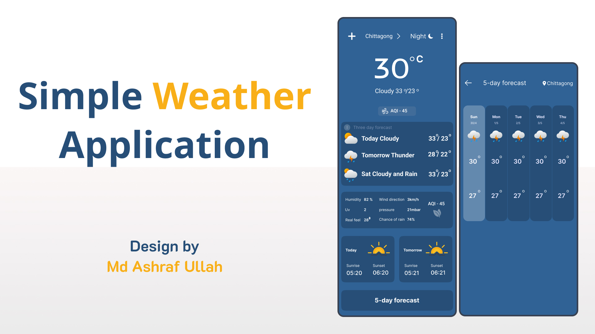
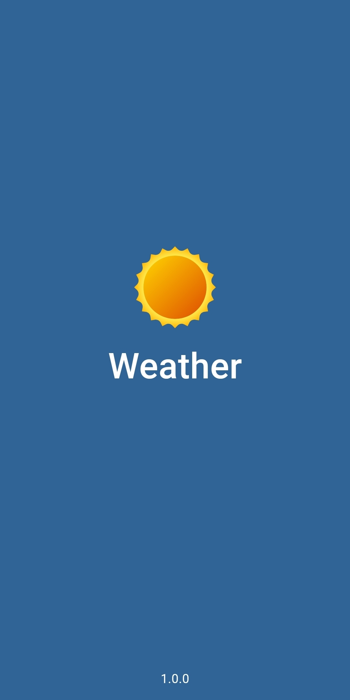
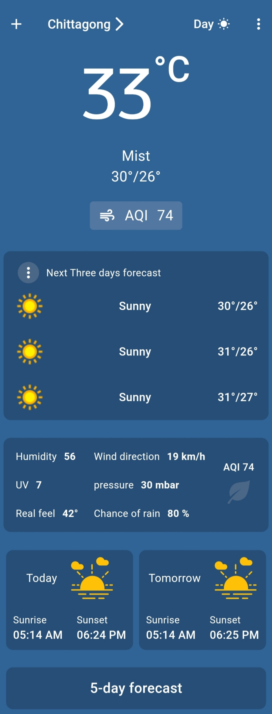
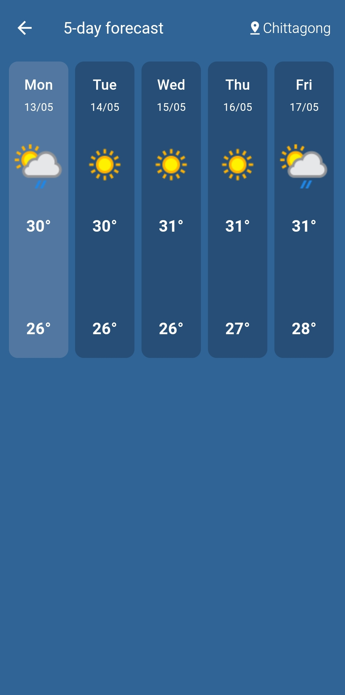
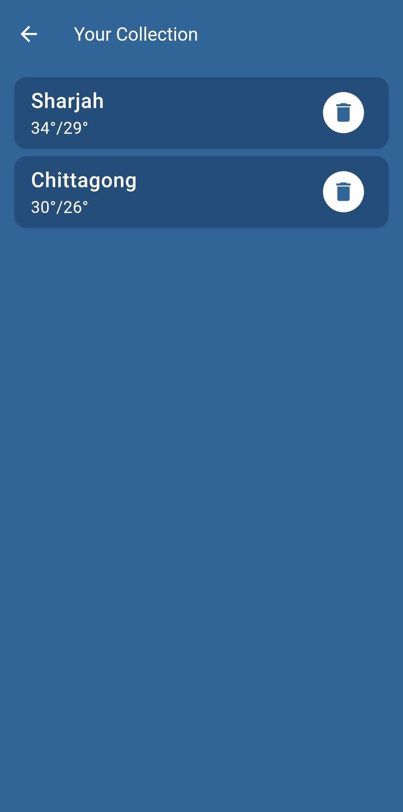
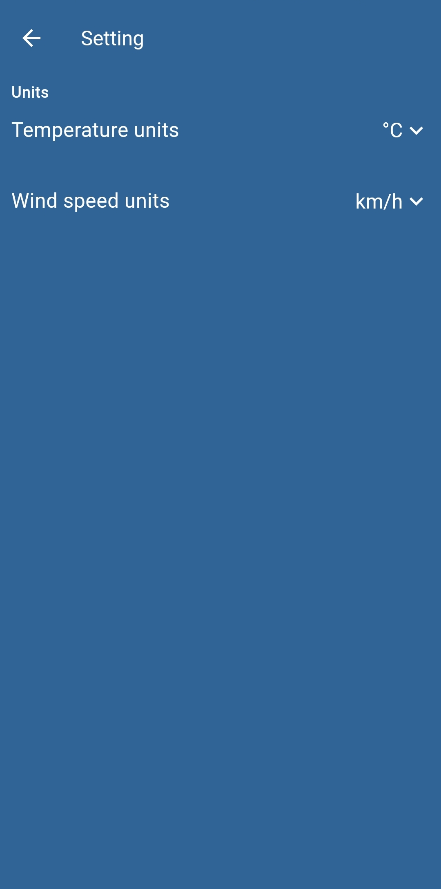
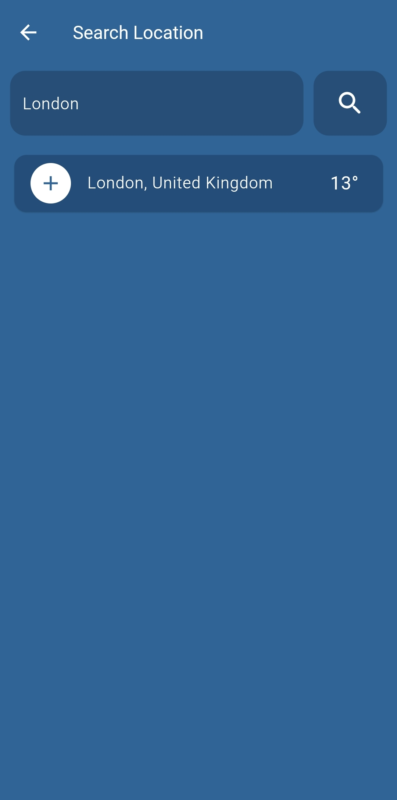

# Weather🌤️



Welcome to Weather App, your ultimate companion for checking the weather on-the-go! With beautiful UI and accurate forecasts, never get caught unprepared again.

## Features

- **Real-time Weather Updates:** Get up-to-date weather information for your city.
- **Multiple Locations:** Add and monitor the weather in multiple cities around the world.
- **Detailed Forecasts:** View detailed forecasts including temperature, humidity, wind speed, and more.
- **Five-Day Forecasts:** You can see a 5-day forecast with important details.
- **Sunrise and Sunset:** You can see Today's and Tomorrow's sunrise and sunset time.
- **Customizable Settings:** Personalize your app experience with temperature and wind units.
- **Deleted Saved Location:** You can Delete saved location if you want.
- **Intuitive UI:** Clean and intuitive interface for seamless navigation and user experience.

## instruction
- When you run the app for the first time, the search screen appears after the splash screen.
- Then you have to add a location name.
- Then you will be redirected to the home screen.
- In-Home Screen at the top you find add(+) Button. which navigates to the search screen.
- The 3-dot button at the top right side navigates to the settings screen.
- On clicking on the location name in the Home screen, you will navigate to your saved collection list.
- If you have saved some location then every time you open the app you see the Home Screen after the splash screen.

## Screenshots
<table style="width:100%">
  <tr>
    <th>Splash Screen</th>
    <th>Home Screen</th>
    <th>5 Day Forecast Screen</th>
    
  </tr>
  <tr>
    <td></td>
    <td></td>
    <td></td>
   
  </tr>
  <tr>
    <th>Save Location Screen</th>
    <th>Setting Screen</th>
    <th>Search Screen</th>
  </tr>
  <tr>
    <td></td>
    <td></td>
    <td></td>
  </tr>
</table>

## Video Demo
https://github.com/MdAshrafUllah/weather_app/assets/96839511/0ffed94d-425a-4786-96ed-7b159bb926fd

## Dewonloiad Apk
   [Download APK - Support Any Android - 20.9 MB](https://drive.google.com/file/d/1w5vQ2qQwE_43qoZxEa1ttZXnAXjVoWnq/view?usp=sharing)


## Setup and Run
``` bash
git clone https://github.com/MdAshrafUllah/weather_app.git 
``` 

``` bash
Flutter pub get
```

``` bash
Flutter run
```

or if you have FVM then Run this after Cloneing

``` bash
fvm flutter pub get
```

``` bash
fvm flutter run
```

